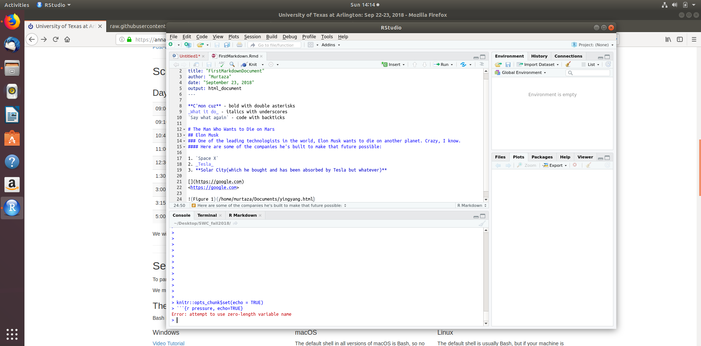

**C'mon cuz** - bold with double asterisks  
_What it do_ - italics with underscores  
`Say what again` - code with backticks

# The Man Who Wants to Die on Mars
## Elon Musk
### One of the leading technologists in the world, Elon Musk wants to die on another planet. Crazy, I know.
#### Here are some of the companies he's built to make that future possible:

1. `Space X`
2. _Tesla_
3. **Solar City(which he bought and has been absorbed by Tesla but whatever)** 

[](https://google.com)
<https://google.com>

 make sure to use the right brackets and parans idiot

```{r load_data}
gapminder <- read.table("Data/gapminder.txt", header = TRUE)
head(gapminder)

library(ggplot2)
ggplot(data = gapminder[gapminder$country=="Canada",], aes(x = year, y = lifeExp)) + geom_line(aes(color = "red")) + labs(title = "Canada Life Exp over Years")
```

```{r stuff, echo = FALSE, results='hide', eval=FALSE, warning=FALSE, fig.height=8, fig.width=8}
par(mar=rep(0, 4), bty="n", cex=1.5)
plot(0, 0, type="n", xlab="", ylab="", xaxt="n", yaxt="n",
     xlim=c(0, 100), ylim=c(0, 100))
xw <- 10
yh <- 35
xm <- 12
ym <- 50
rect(xm-xw/2, ym-yh/2, xm+xw/2, ym+yh/2, lwd=2)
text(xm, ym, ".Rmd")

xm <- 50
ym <- 80
rect(xm-xw/2, ym-yh/2, xm+xw/2, ym+yh/2, lwd=2)
text(xm, ym, ".md")
xm <- 50; ym <- 25
for(i in c(2, 0, -2))
    rect(xm-xw/2+i, ym-yh/2+i, xm+xw/2+i, ym+yh/2+i, lwd=2,
         border="black", col="white")
text(xm-2, ym-2, "figs/")

xm <- 100-12
ym <- 50
rect(xm-xw/2, ym-yh/2, xm+xw/2, ym+yh/2, lwd=2)
text(xm, ym, ".html")

arrows(22, 50, 38, 50, lwd=2, col="slateblue", len=0.1)
text((22+38)/2, 60, "knitr", col="darkslateblue", cex=1.3)

arrows(62, 50, 78, 50, lwd=2, col="slateblue", len=0.1)
text((62+78)/2, 60, "pandoc", col="darkslateblue", cex=1.3)
```

# In line codes
The average of the class in `r round(44.069450234, 3)`. 

